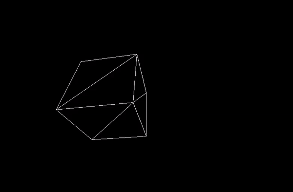

# 3D-Engine

Passion project inspired by Bisqwit's [Doom Engine video](https://www.youtube.com/watch?v=HQYsFshbkYw&t=136s). However please note that this is not a [portal engine](https://en.wikipedia.org/wiki/Portal_rendering) and instead follows the design principles presented by javidx9 in his [3D engine Youtube series](https://www.youtube.com/watch?v=ih20l3pJoeU&t=780s). If you are looking for information about portal engine design then have a look at [Jacco Bikker's blog series](https://www.flipcode.com/archives/Building_a_3D_Portal_Engine-Issue_01_Introduction.shtml).

## Project Goals

Personally, I am interested in the math and algorithms, 3D engines employ. This project is a way for me to experiment with them and gain a comprehensive understanding of what happens under the hood of modern tools such as Unity and Unreal Engine. Storing all the topic related articles in one place might be useful for both my future self and others.

Finally, it's a great excuse to start learning C++.

## Progress Demos

Bellow you can see gifs of the engine running in it's various states of development:

* Basic unit cube spinning with some simple rendering optimization:
  
  

## Installation

On Linux having SDL2 installed and running "make run" in the directory you cloned this repo should be enough to compile and run the application.
Mac/Windows should be a similar process altough I have not formally tested the compilation process on them.

## Learning Resources
  * [javidx9's YouTube series](https://www.youtube.com/watch?v=ih20l3pJoeU&t=780s)
  * [Deriving Projection Matrices](https://www.codeguru.com/cpp/misc/misc/graphics/article.php/c10123/Deriving-Projection-Matrices.htm#page-1)
  * [SDL2 tutorial](https://lazyfoo.net/tutorials/SDL/)
